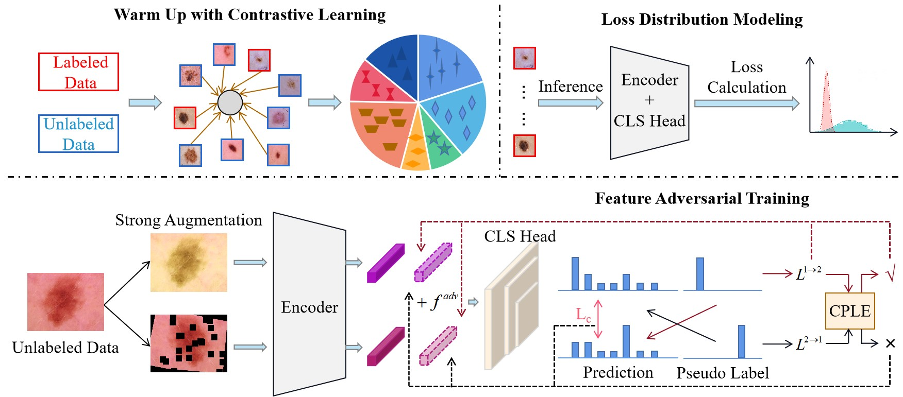

# PEFAT: Boosting Semi-supervised Medical Image Classification via Pseudo-loss Estimation and Feature Adversarial Training

### Introduction

This repository is for CVPR2023 paper '[PEFAT: Boosting Semi-supervised Medical Image Classification via Pseudo-loss Estimation and Feature Adversarial Training](https://openaccess.thecvf.com/content/CVPR2023/papers/Zeng_PEFAT_Boosting_Semi-Supervised_Medical_Image_Classification_via_Pseudo-Loss_Estimation_and_CVPR_2023_paper.pdf)'.   



### Usage
Train the model

python ./code/train.py

## Citation

If this repository is useful for your research, please consider citing:
```
@inproceedings{zeng2023pefat,
  title={PEFAT: Boosting Semi-Supervised Medical Image Classification via Pseudo-Loss Estimation and Feature Adversarial Training},
  author={Zeng, Qingjie and Xie, Yutong and Lu, Zilin and Xia, Yong},
  booktitle={Proceedings of the IEEE/CVF Conference on Computer Vision and Pattern Recognition},
  pages={15671--15680},
  year={2023}
}
```

## Acknowledgement
This work is mainly based on [SRC-MT](https://github.com/liuquande/SRC-MT), [VAT](https://arxiv.org/pdf/1704.03976.pdf), [M-DYR](https://arxiv.org/pdf/1904.11238.pdf) and [DivideMix](https://openreview.net/pdf?id=HJgExaVtwr). Thanks for these authors for their valuable works.
